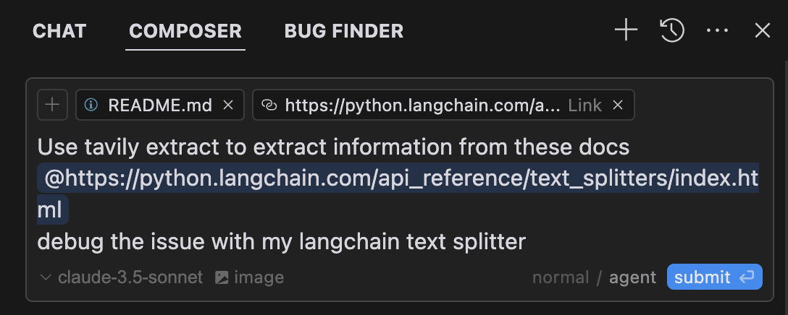
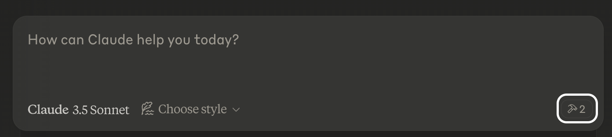

# Tavily MCP Server 🚀


> 🔌 **Compatible with [Cline](https://github.com/cline/cline), [Cursor](https://cursor.sh), [Claude Desktop](https://claude.ai/desktop), and any other MCP Clients!**
>
> Tavily MCP is also compatible with any MCP client
>
> 📚  [tutorial](https://medium.com/@dustin_36183/building-a-knowledge-graph-assistant-combining-tavily-and-neo4j-mcp-servers-with-claude-db92de075df9) on combining Tavily MCP with Neo4j MCP server!
> 
> 📚  [tutorial](https://medium.com/@dustin_36183/connect-your-coding-assistant-to-the-web-integrating-tavily-mcp-with-cline-in-vs-code-5f923a4983d1) Integrating Tavily MCP with Cline in VS Code ( Demo + Example Use-Cases)
>


The Model Context Protocol (MCP) is an open standard that enables AI systems to interact seamlessly with various data sources and tools, facilitating secure, two-way connections.

Developed by Anthropic, the Model Context Protocol (MCP) enables AI assistants like Claude to seamlessly integrate with Tavily's advanced search and data extraction capabilities. This integration provides AI models with real-time access to web information, complete with sophisticated filtering options and domain-specific search features.

The Tavily MCP server provides:
- Seamless interaction with the tavily-search and tavily-extract tools
- Real-time web search capabilities through the tavily-search tool
- Intelligent data extraction from web pages via the tavily-extract tool


## Prerequisites 🔧

Before you begin, ensure you have:

- [Tavily API key](https://app.tavily.com/home)
  - If you don't have a Tavily API key, you can sign up for a free account [here](https://app.tavily.com/home)
- [Claude Desktop](https://claude.ai/download) or [Cursor](https://cursor.sh)
- [Node.js](https://nodejs.org/) (v20 or higher)
  - You can verify your Node.js installation by running:
    - `node --version`
- [Git](https://git-scm.com/downloads) installed (only needed if using Git installation method)
  - On macOS: `brew install git`
  - On Linux: 
    - Debian/Ubuntu: `sudo apt install git`
    - RedHat/CentOS: `sudo yum install git`
  - On Windows: Download [Git for Windows](https://git-scm.com/download/win)

## Tavily MCP server installation ⚡

To install the tavily-mcp server, you can use the following methods:
1. Running with NPX 
2. Git installation

### 1. Running with NPX 

```bash
npx -y tavily-mcp@0.1.3  
```

Although you can launch a server on its own, it's not particularly helpful in isolation. Instead, you should integrate it into an MCP client. Below is an example of how to configure the Claude Desktop app to work with the tavily-mcp server.


## Configuring MCP Clients ⚙️

This repository will explain how to configure both [Cursor](https://cursor.sh) and [Claude Desktop](https://claude.ai/desktop) to work with the tavily-mcp server.


### Configuring Cline 🤖

The easiest way to set up the Tavily MCP server in Cline is through the marketplace with a single click:

1. Open Cline in VS Code
2. Click on the Cline icon in the sidebar
3. Navigate to the "MCP Servers" tab ( 4 squares )
4. Search "Tavily" and click "install"
5. When prompted, enter your Tavily API key

Alternatively, you can manually set up the Tavily MCP server in Cline:

1. Open the Cline MCP settings file:

   ### For macOS:
   ```bash
   # Using Visual Studio Code
   code ~/Library/Application\ Support/Code/User/globalStorage/saoudrizwan.claude-dev/settings/cline_mcp_settings.json
   
   # Or using TextEdit
   open -e ~/Library/Application\ Support/Code/User/globalStorage/saoudrizwan.claude-dev/settings/cline_mcp_settings.json
   ```

   ### For Windows:
   ```bash
   code %APPDATA%\Code\User\globalStorage\saoudrizwan.claude-dev\settings\cline_mcp_settings.json
   ```

2. Add the Tavily server configuration to the file:

   Replace `your-api-key-here` with your actual [Tavily API key](https://tavily.com/api-keys).

   ```json
   {
     "mcpServers": {
       "tavily-mcp": {
         "command": "npx",
         "args": ["-y", "tavily-mcp@0.1.3"],
         "env": {
           "TAVILY_API_KEY": "your-api-key-here"
         },
         "disabled": false,
         "autoApprove": []
       }
     }
   }
   ```

3. Save the file and restart Cline if it's already running.

4. When using Cline, you'll now have access to the Tavily MCP tools. You can ask Cline to use the tavily-search and tavily-extract tools directly in your conversations.


### Configuring Cursor 🖥️

> **Note**: Requires Cursor version 0.45.6 or higher

To set up the Tavily MCP server in Cursor:

1. Open Cursor Settings
2. Navigate to Features > MCP Servers
3. Click on the "+ Add New MCP Server" button
4. Fill out the following information:
   - **Name**: Enter a nickname for the server (e.g., "tavily-mcp")
   - **Type**: Select "command" as the type
   - **Command**: Enter the command to run the server:
     ```bash
     env TAVILY_API_KEY=your-api-key npx -y tavily-mcp@0.1.3
     ```
     > **Important**: Replace `your-api-key` with your Tavily API key. You can get one at [app.tavily.com/home](https://app.tavily.com/home)

After adding the server, it should appear in the list of MCP servers. You may need to manually press the refresh button in the top right corner of the MCP server to populate the tool list.

The Composer Agent will automatically use the Tavily MCP tools when relevant to your queries. It is better to explicitly request to use the tools by describing what you want to do (e.g., "User tavily-search to search the web for the latest news on AI"). On mac press command + L to open the chat, select the composer option at the top of the screen, beside the submit button select agent and submit the query when ready.



### Configuring the Claude Desktop app 🖥️
### For macOS:

```bash
# Create the config file if it doesn't exist
touch "$HOME/Library/Application Support/Claude/claude_desktop_config.json"

# Opens the config file in TextEdit 
open -e "$HOME/Library/Application Support/Claude/claude_desktop_config.json"

# Alternative method using Visual Studio Code (requires VS Code to be installed)
code "$HOME/Library/Application Support/Claude/claude_desktop_config.json"
```

### For Windows:
```bash
code %APPDATA%\Claude\claude_desktop_config.json
```

### Add the Tavily server configuration:

Replace `your-api-key-here` with your actual [Tavily API key](https://tavily.com/api-keys).

```json
{
  "mcpServers": {
    "tavily-mcp": {
      "command": "npx",
      "args": ["-y", "tavily-mcp@0.1.2"],
      "env": {
        "TAVILY_API_KEY": "your-api-key-here"
      }
    }
  }
}
```

### 2. Git Installation

1. Clone the repository:
```bash
git clone https://github.com/tavily-ai/tavily-mcp.git
cd tavily-mcp
```

2. Install dependencies:
```bash
npm install
```

3. Build the project:
```bash
npm run build
```
### Configuring the Claude Desktop app ⚙️
Follow the configuration steps outlined in the [Configuring the Claude Desktop app](#configuring-the-claude-desktop-app-️) section above, using the below JSON configuration.

Replace `your-api-key-here` with your actual [Tavily API key](https://tavily.com/api-keys) and `/path/to/tavily-mcp` with the actual path where you cloned the repository on your system.

```json
{
  "mcpServers": {
    "tavily": {
      "command": "npx",
      "args": ["/path/to/tavily-mcp/build/index.js"],
      "env": {
        "TAVILY_API_KEY": "your-api-key-here"
      }
    }
  }
}
```

## Usage in Claude Desktop App 🎯

Once the installation is complete, and the Claude desktop app is configured, you must completely close and re-open the Claude desktop app to see the tavily-mcp server. You should see a hammer icon in the bottom left of the app, indicating available MCP tools, you can click on the hammer icon to see more detial on the tavily-search and tavily-extract tools.



Now claude will have complete access to the tavily-mcp server, including the tavily-search and tavily-extract tools. If you insert the below examples into the Claude desktop app, you should see the tavily-mcp server tools in action.

### Tavily Search Examples

1. **General Web Search**:
```
Can you search for recent developments in quantum computing?
```

2. **News Search**:
```
Search for news articles about AI startups from the last 7 days.
```

3. **Domain-Specific Search**:
```
Search for climate change research on nature.com and sciencedirect.com
```

### Tavily Extract Examples 

1. **Extract Article Content**:
```
Extract the main content from this article: https://example.com/article
```

### ✨ Combine Search and Extract ✨

You can also combine the tavily-search and tavily-extract tools to perform more complex tasks.

```
Search for news articles about AI startups from the last 7 days and extract the main content from each article to generate a detailed report.
```

## Troubleshooting 🛠️

### Common Issues

1. **Server Not Found**
   - Verify the npm installation by running `npm --verison`
   - Check Claude Desktop configuration syntax by running `code ~/Library/Application\ Support/Claude/claude_desktop_config.json`
   - Ensure Node.js is properly installed by running `node --version`
   
2. **NPX related issues**
  - If you encounter errors related to `npx`, you may need to use the full path to the npx executable instead. 
  - You can find this path by running `which npx` in your terminal, then replace the `"command":  "npx"` line with `"command": "/full/path/to/npx"` in your configuration.

3. **API Key Issues**
   - Confirm your Tavily API key is valid
   - Check the API key is correctly set in the config
   - Verify no spaces or quotes around the API key

## Acknowledgments ✨

- [Model Context Protocol](https://modelcontextprotocol.io) for the MCP specification
- [Anthropic](https://anthropic.com) for Claude Desktop
